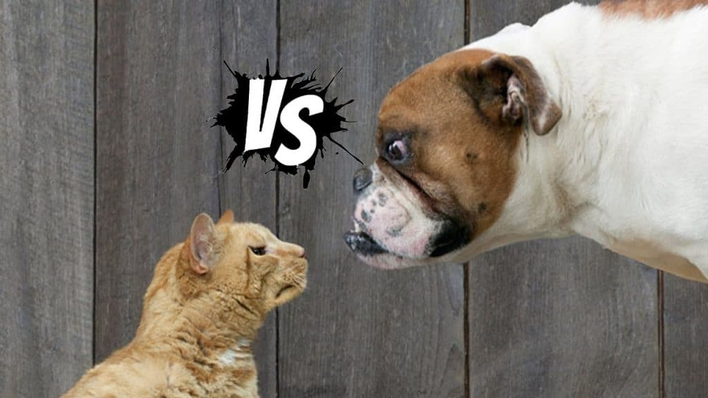

# cat-or-dog

Exemplo de problema de classificação utilizando redes neurais convolucionais para extrair features e uma camada fully connected para fazer as predições das classes de interesse. Nesse caso temos duas classes (gato, cão).

Dataset utilizado [link!](https://www.kaggle.com/uysimty/keras-cnn-dog-or-cat-classification/data?select=train.zip)

  

O código original pode ser encontrado no [kaggle!](https://www.kaggle.com/brunafrade/keras-cnn-dog-or-cat-classification/edit)
